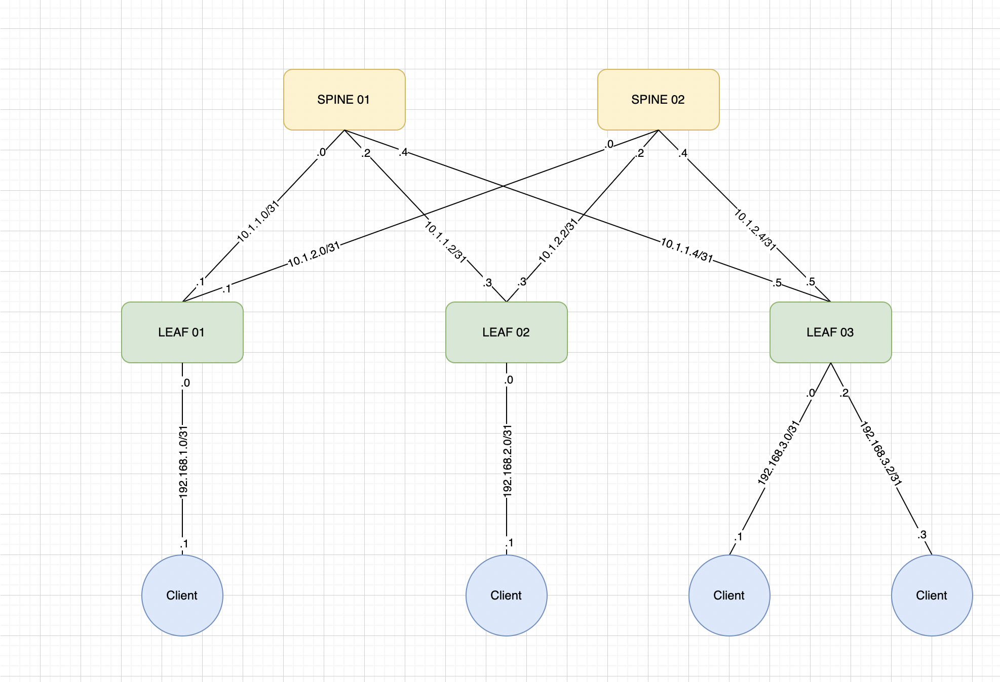

## Цель: Собрать схему CLOS. Распределить адресное пространство для Underlay сети.
Принципы назначения IP адресов
Выдача IPv4 адресов
Принципы выделения IPv4-адресов для построения Underlay сети:
<dd> • для организации внутренней связности выдаем адреса из приватной сети 10.0.0.0/8</dd>
<dd>• для p2p сетей между spine и leaf коммутаторами используем маску сети /31</dd>
<dd>• второй октет адреса - соответсвует номеру ДЦ (в нашем случае только один ДЦ)</dd>
<dd>• третий октет - соответсвует номеру spine </dd>
<dd>• четвёртый октет - значение по порядку, младший ip - spine, старший ip - leaf</dd>

  
  
### Распределение адресного пространства:
Spine01:

<dd>Net 10.1.1.0/31; Spine01 (.0) to Leaf01 (.1)</dd>
<dd>Net 10.1.1.2/31; Spine01 (.2) to Leaf02 (.3)</dd>
<dd>Net 10.1.1.4/31; Spine01 (.4) to Leaf03 (.5)</dd>

<dd>Spine02:  
  
<dd>Net 10.1.2.0/31; Spine02 (.0) to Leaf01 (.1)</dd>
<dd>Net 10.1.2.2/31; Spine02 (.2) to Leaf02 (.3)</dd>
<dd>Net 10.1.2.4/31; Spine02 (.4) to Leaf03 (.5)</dd>
<dd>Принципы выделения IPv4-адресов для подключения клиентов:</dd>
<dd> • для организации связности с клиентами выдаем адреса из приватной сети 192.168.0.0/16</dd>
<dd> • для p2p сетей между leaf коммутаторами и клиентами используем маску сети /31</dd>
<dd>• третий октет адреса - соответсвует номеру leaf</dd>
<dd>• четвёртый октет - значение по порядку, младший ip - leaf, старший ip - Клиент.</dd>
