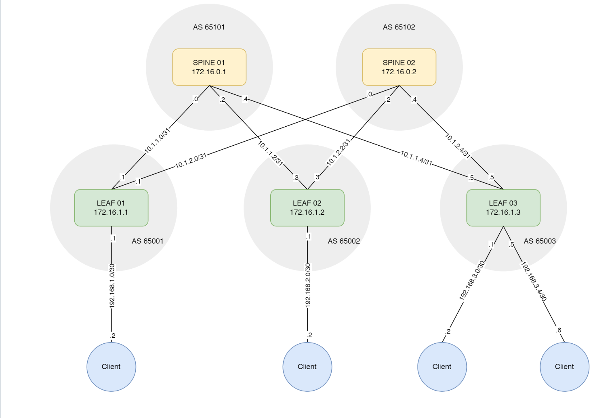

## Лабораторная работа: Underlay. BGP
Цель:
Настроить еBGP для Underlay сети

<dd>План работы:</dd>
#Принципы назначения IP адресов:
Принципы выделения IPv4-адресов для построения Underlay сети:
<dd>• для организации внутренней связности выдаем адреса из приватной сети 10.0.0.0/8</dd>
<dd>• для p2p сетей между spine и leaf коммутаторами используем маску сети /31</dd>
<dd>• второй октет адреса - соответсвует номеру ДЦ (в нашем случае только один ДЦ)</dd>
<dd>• третий октет - соответсвует номеру spine</dd>
<dd>• четвёртый октет - значение по порядку, младший ip - spine, старший ip - leaf</dd>

Принципы назначения IPv4-адресов для подключения клиентов:
<dd>• для организации связности с клиентами выдаем адреса из приватной
сети 192.168.0.0/16</dd>
<dd>• для p2p сетей между leaf коммутаторами и клиентами используем маску сети /30</dd>
<dd>• третий октет адреса - соответсвует номеру leaf</dd>
<dd>• четвёртый октет - значение по порядку, младший ip - leaf, старший ip - Клиент</dd>
Принципы выделения IPv4-адресов для Loopback интерфейсов:
<dd>• для Loopback интерфейсов выдаем адреса из приватной сети 172.16.0.0/12</dd>
<dd>• второй октет адреса 16 - соответсвует номеру ДЦ (в нашем случае только один ДЦ)</dd>
<dd>• третий октет - 0 соответсвует уровню spine; 1 - соответствует уровню leaf</dd>
<dd>• четвёртый октет - значение по порядку, соответствует номеру spine/leaf</dd>
<dd>  </dd>
<dd>  </dd>

<dd>Распределение адресного пространства используется из предыдущих лабораторных работ
и отражено на схеме сети.</dd>
<dd>Распределение номеров автономных систем (AS):</dd>
<dd>  </dd>
<dd>Spine01: 65101</dd>
<dd>Spine02: 65102</dd>
<dd>Leaf01: 65001</dd>
<dd>Leaf01: 65002</dd>
<dd>Leaf01: 65003</dd>

